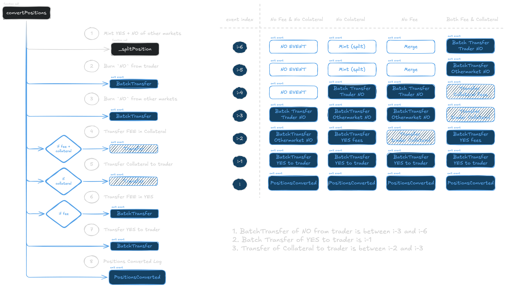

# How to build Polymarket Positions and Resolutions dataset on Dune

About a month ago, I was working on building a framework to detect Insider trading in Polymarket, in response to an application. One of the major features I wanted to include was profits, alongside others such as betsize and spread crossed. While I was trying to build the PnL dataset, I couldnt find a single reliable source. Dune is litered with AI Agents attempting to bruteforcing calculations, hence even if there was any alpha there, its surely lost in all the noise. 
Sanity checking existing calculation methodologies, whichever kinda made sense were running into negative balances, wrong PnLs. I tend to build a single master table of actions, before I build any KPI or feature. The sanity of the underlying data is the most important part of building any data driven research.

## What 

Resolution data is the broad PnL data for each trade of position.

## Why
Polymarket API provides three endpoints that could in be used to pull the resolution data 
1. `https://data-api.polymarket.com/v1/market-positions`
2. `https://data-api.polymarket.com/positions`
3. `https://data-api.polymarket.com/closed-positions` 

However for historical data, there endpoints only return the final snapshot data. Important details such as cost of position, spread, individual trade breakdown are not available.
Building it from onchain data gives it verifiability, and also allows it to be used in combination with other onchain data.

## Current attempts

The most common methodology used to calculate Resolution is: 
Aggregate USD delta from Clob trades (built from `OrderFilled` events) and combine with `PayoutRedemption` events. The logic is that users enter and increase positions from buying on the CLOB; while they exit or decrease positions by selling to the CLOB or holding until resolution. resolution only pays when there is a successful position. 

The issues with this is that: 
1. As Storm Slivikoff pointed out [blog](https://www.paradigm.xyz/2025/12/polymarket-volume-is-being-double-counted), the order filled events need to be correctly filtered to avoid double counting. A simple fix for this is to only consider makers and ignore taker side of the trade.
2. The main assumption that Enter and Exit is only from Clob is wrong. This can be verified by computing the shares delta from the Clob trades and performing a basic balance sanity check for negative balances.

Some means of fixes:
1. Track shares directly - Every Polymarket position is stored as a ERC1155. This means, we can unwrap `BatchTransfer` events and combine it with `SingleTransfer` events to compute the balance at any point, like a traditional ERC20 balance. However calculating the USD invested in acquiring such a balance, spreads crossed can be cumbersome, and hence this is not viable as our main aim is to compute the PnL at any instant. This is correct way to calculate the historical shares balance, but it fails to include key data thats required for analysis. 

Whats missing ? 
Since we know all polymarket positions are stored as ERC1155, and that these balances cannot be negative, we must be missing some component. Looking into deltas on a trade by trade basis, a few key points pops out. 

Not all trades are giving you the right information. A key feature of Polymarket are Split and Merge positions, do not confuse these with the 3 types of trade from Slivikoff's blog, i.e:
* Swap: A standard exchange of YES/NO tokens between the maker and taker, in exchange for USD.
* Split: A taker and maker jointly deposit USD, and receive same amount of YES/NO tokens respectively.
* Merge: A taker and maker jointly deposit same amount of YES/NO tokens, and receive USD. 

Outside of the CLOB:
1. Split allows a trader to deposit Collateral - minting YES/NO pairs, and selling for example NO into the market and thus getting a net YES position. [ref](https://startpolymarket.com/learn/splitting/)
2. Merge allows a trader to withdraw Collateral - by burning YES/NO pairs, buying for example NO from market, and combining existing YES wallet balance, thus reducing YES position. [ref](https://startpolymarket.com/learn/merging/)

Its immediately obvious how, negative balances can arise, when the minting is not accounted for, thus having a naked SELL without a BUY. Similarly burning results in zero balance, even after buying from the market and not placing any SELLs.

Convert in NegRisk: 
[Neg Risk and Convert](https://startpolymarket.com/learn/converting-negative-risk/)
Negrisk markets represent a set of related but mutually exclusive markets. there might 10 of these markets, but only one can resolve to YES, and the others must resolve to NO. Since holding YES across all markets or NO across all markets is a guaranteed win (PnL depends on the prices at which the aggregate position was obtained). Convert allows users to burn NO tokens for collateral USD, and potentially trade the USD for YES tokens.

Heuristics:
To include Split and Mint trades, we can track `PositionSplit` and `PositionsMerge` event. However, there are two issues: 
1. These events do sometimes occur in a trade, i.e when a `Split` or `Merge` trade occur (as discussed by Paradigm)
2. The events themselves do not always contain the user receiving or sending the shares

For fixing the above: 
1. we filter out txs with a `OrderFilled` event in the same tx.
2. for `Split` we get the correct trader by the recipient from the `BatchTransfer` event adjacent (i.e previous or next event index).
  for `Merge` we get the correct trader by the sender from the `BatchTransfer` at previous index.

For Converts, there are two legs to be tracked. The NO burn and the YES mint. We first track `PositionsConverted` event from Negrisk Adapter, then getting the NO burns and YES mints from adjacent events. NO burns are batch transfers from the trader, within 6 events

Pricing Merge, Split and Converts (aka USD transfers):
* Split trades -> since 1$ of collateral is deposited by the user to mint 1YES + 1NO, a simple heuristic is to price the shares at 0.5$ each
* Merge trades -> since 1YES + 1NO is burnt to redeem 1$ of collateral, that same heuristic of pricing the shares at 0.5$ each works. 
* Convert trades -> Convert event logs the NO tokens burnt, and mints YES tokens

While these include all the normal Polymarket operations, Since the positions are ERC 1155 positions, the holder can themselves transfer these assets. Hence we need to factor these **stray** `SingleTransfer` and `BatchTransfer` events. These can be defined as transfers where the operator, sender and receiver are not a Polymarket contract address. The pricing is 0, since there is no USD transfer involved.

With all these events: 
* Clob Trades 
* Mints 
* Splits
* Converts
* Stray Transfers

you can aggregate to get the balances of the shares. 

## Whats still missing:

[] Convert USD - capture from number of NOs sold - 1 * amount of NO sold
[] 50/50 Resolutions and other kinds of resolutions 

## Refs

* [Polymarket Volume Is Being Double-Counted - Storm Slivkoff - Paradigm](https://www.paradigm.xyz/2025/12/polymarket-volume-is-being-double-counted)
* [U.S. Soldier Charged With Using Classified Information To Profit From Prediction Market Bets - Office of Public Affairs](https://www.justice.gov/opa/pr/us-soldier-charged-using-classified-information-profit-prediction-market-bets)
* [Google Employee Charged With Insider Trading](https://www.justice.gov/usao-sdny/pr/google-employee-charged-insider-trading)
* [Polymarket bettors put $3 million on which crypto firm ZachXBT will expose next - Coindesk](https://www.coindesk.com/markets/2026/02/24/polymarket-bettors-put-usd3-million-on-which-crypto-firm-zachxbt-will-expose-next)
* [Insiders cashed in before Axiom reveal, Wallets bagged $1M on Polymarket](https://www.cryptopolitan.com/insiders-cashed-in-before-axiom-reveal-wallets-bagged-1m-on-polymarket)
* [Polymarket PnL Calculation: Why Your Profit Numbers Are Probably Wrong](https://leolabs.me/blog/pnl-calculation/en/)
* [Decoding the Digital Tea Leaves: A Guide to Analyzing Polymarket’s On-Chain Order Data](https://yzc.me/x01Crypto/decoding-polymarket)
