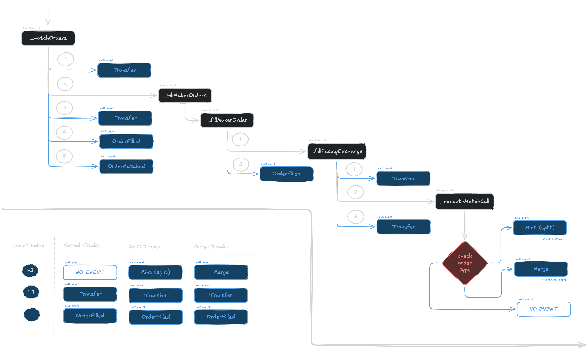

# How to build a Polymarket Resolution dataset on Dune

## 1.Introduction
About a month ago, I started working on a framework to detect insider trading on polymarket. I decided to use Dune as the source of data, since its easier to verify the data, by building it from first principles, rather than relying on the Polymarket API. One of the main features I wanted to use was PnL per position. However, I couldn't find a reliable source of this data. There are multiple existing methodologies that looks reasonable, but breakdown the moment you run some basic sanity checks. The integrity of the PnL data is important to anything thats build on top of it. Hence I decided to delve deeper into the task of building a reliable PnL dataset on Dune, with auditable ledger, straight up from onchain data. 
This report is a documentation of the process: what are the obvious approaches, the flaws in them, where they break and how to fix them. We use example to pin point how each assumption breaks, and how the same example gets fixed at the end of the process.
We will build an event-ledger that tracks all the onchain events associated with polymarket positions, using it to reconstruct wallet-market level shares, USD flows and PnL. We will normailize all events into a common accounting model, and the resulting ledger can be used beyond just PnL calculations, and can be used to build downstream features such as execution behaviour and fill price dispersion.

## 2. The drawbacks of the obvious source
Choosing Dune as my data source was a major decision, esp when pretty much every other analytics framework from explorers to twitter bots utilize Polymarket's API source. This decision, is made worse by the fact that quite alot of Dune's prediction market data is now closed and available only to Enterprise customers. 

Polymarket's own API provides three endpoints that are in-general used to pull the required data. 

| Endpoint | What it gives you | What it's missing |
|---|---|---|
| `/v1/market-positions` | Current position snapshot | No history, no cost basis |
| `/positions` | Position snapshot | No trade-level breakdown, no spread |
| `/closed-positions` | Final resolved snapshot | No entry price, no path taken to get there |
The problem with these endpoint is that, 
1. They are closed source and blackboxed
2. What you get is what you have - you get a final state, no historical data, no 2nd order analytics. (the same problem faced by every GraphQL endpoint)
Important info like, entry and exit prices, fill spreads are condensed into a single `avgPrice` data point.
One can assume they can circumnavigate the lack of historical data, utilizing the `/trades` endpoint. But as you will soon see, there is more to a position than trades alone.
With respect to close source, building the dataset from onchain data gives the dataset verifiability, each action auditable and the ability to combine it with other onchain data.

## 3. The naive methodologies on Dune

Now that I have chosen the source of Data, I look at existing works. 

### 3.1. CLOB only position reconstruction

The most common approach is to aggregate USD delta from CLOB trades, built on top of `OrderFilled` events and combine it with USD withdrawn from `PayoutRedemption` events. As someone looking at Polymarket data structure for the first time, this sounds like a sound methodology.
> *A user can enter or exit positions through the CLOB and exit on Redemption*

A position in Polymarket is stored as a ERC-1155 token share. Since this is a token share, this share cannot be negative. In order to validate the above assumption, we hence try to compute the shares delta from each CLOB trade or `OrderFilled` event.

Lets look at an example (its a chosen case for demonstration and you will soon see this is a very common case), where the wallet `0xce296aaf92ecc022cc6608a54c622bb1c445b71b` trades the `Will Gemini 3.0 be released on November 17 2025?` market. The market has two tokens:
| Token Side  | Token  |
| ----------- | ------ |
| YES         | `46687945077176076830096477597797725250961514733182621481405351828163193903577`|
| NO          | `113016318552201794810557514937858326971831314187777686552865771003364240784846`|

If you take a look at all the CLOB trades of the user in the market:

| Timestamp           | Shares | Token Side | Direction | Shares Delta | Shares Cumulative | Flag | Token Price | USD Volume | Tx Link |  
| ------------------- | ------ | ---------- | --------- | ------------ | ----------------- | ---- | ---- | ---- | ----    |
| 2025-11-14 19:45:32 | 362.10 | NO         | BUY       | 362.10       | 362.10            | ✅   | 0.952 |	344.92 | [🔗](https://polygonscan.com/tx/0xb5c4db10463d7a05665e06794afe8400868baab79731296c0581df491ac5708a#eventlog) | 
| 2025-11-15 02:53:26 | 100    | NO         | SELL      | -100         | 262.10            | ✅   | 0.962 |	96.20 | [🔗](https://polygonscan.com/tx/0xc992ae2be4d33a2846dfcce465085ada3b9579f8e163281d00b7e25b18c6e0e3#eventlog) | 
| 2025-11-15 02:53:40 | 100    | NO         | SELL      | -100         | 162.10            | ✅   | 0.962 |	96.20 | [🔗](https://polygonscan.com/tx/0x4b67a585377cedcb7bc33f64dda9f72329d12c586365244c9ea53fc9f9a99b51#eventlog) | 
| 2025-11-15 02:56:36 | 162.1  | NO         | SELL      | -162.1       | 0.00              | ✅   | 0.954 |	154.64 | [🔗](https://polygonscan.com/tx/0x8c274aaeecacabd2f5e8d16de0c7cc1590035f6e5a4d5937308068f5a0727796#eventlog) | 
| 2025-11-15 03:29:28 | 100    | YES        | SELL      | -100         | -100              | 🚩   | 0.030	| 3.00 | [🔗](https://polygonscan.com/tx/0x76e3dc9817333f189a3526485a1538c0ddc33f74ace05e144036ae8a2b37af13#eventlog) | 
| 2025-11-15 03:32:04 | 250    | YES        | SELL      | -250         | -350              | 🚩   | 0.030 |	7.50 | [🔗](https://polygonscan.com/tx/0x42424044aed3d4bc83ab792bab84cf890d40a694fb7584df30810b7cfaea02d4#eventlog) | 

You can see how the 5th transaction sells YES token, that the user never bought.

Some approaches attempt to sidestep this by including wallets whose books will close cleanly using CLOB trades alone, i.e balances are non-negative. This is an approach that doesn't explain or explore the consequences of this missed section.

[TODO: STRUCTURE THIS BETTER]
A bigger issue with this methodology is that, the methodology doesn't understand the trade being placed, and the larger context behind the trade. To a new analyst, it looks like the user is selling YES tokens, but in reality, this trade was a 2nd leg of a trade where they were increasing their NO position. 
A key tell is, if you look at the above example, you might notice that that the trader buys NO around 95 cents and sells NO around 96 cents. This is a known yield farming strategy on Polymarket, where wallets buy tokens close to resolution to take advantage of the last bit of price movement, which is highly likely to close at 1 dollar. This wallet in particular has been making such trades quite frequently, thus the low price selling is very odd.

### 3.2. ERC 1155 balance reconstruction

This is the default way that enterprise customers of Dune, very likely get their position historical data. In now removed (closed source) Spells, Dune reconstructs ERC 1155 balances by aggregating `SingleTransfer` and `BatchTransfer` event deltas. 
This is the correct way to reconstruct position balances. However, it misses alot of of key features, the most important being the USD invested in gaining the position and USD realized upon selling. This approach also doesn't discern between a normal Wallet to Wallet transfer and a Trade or many of the other Ledger update events.
One might suggest building this balance from ERC1155 transfer events, and then combining it with CLOB trades would solve the problem, but it still wouldn't be enough.

This on the other hand, would help us solve the problem of what all could be possibly missing outside of CLOB trades.

## Reconstructing the CLOB

This is a section, that can be skipped if your only concern is to recreate Resolution balances. If you are however interested in understanding fill events, and what the onchain doesn't tell you about the Fills, this section is for you.

Storm Slivkoff discovered in [Polymarket Volume Is Being Double-Counted](https://www.paradigm.xyz/2025/12/polymarket-volume-is-being-double-counted) that a single market order trigger multiple `OrderFilled` events: one for each individual maker fill, and a single final `OrderFilled` event that summarizes all the fills. Lets call this final `OrderFilled` event as **FullOrder**. Analysts before that naively aggregated events, thus double-counting the volume.
The standard `OrderFilled` event follows the following structure:
```solidity
OrderFilled (
  index_topic_1 bytes32 orderHash,
  index_topic_2 address maker,
  index_topic_3 address taker,
  uint256 makerAssetId,
  uint256 takerAssetId,
  uint256 makerAmountFilled,
  uint256 takerAmountFilled,
  uint256 fee
)
```
The individual fills correctly post the makers and takers onchain. The final `OrderFilled` event however, posts the taker wallet as the maker, and the maker is the Polymarket Market contract. This key distinction can be used to efficiently distinguist between individual fills and summary fill. This is the common pre-processing step to filter trades to avoid double counting volume.

The article by Slivkoff also explains the 3 different types of CLOB trades:
- **Swap**:  A standard exchange of YES/NO tokens between the maker and taker, in exchange for USD.
- **Split**: A taker and maker jointly deposit USD, and receive same amount of YES/NO tokens respectively.
- **Merge**: A taker and maker jointly deposit same amount of YES/NO tokens, and receive USD.




[TODO: improve wording here, and confirm what I say about the article]
However, the article itself doesn't delve deeper into finer details beyond that. Lets check a specific fill event. 

[TODO: add sample transaction to show how usd and price don't match, and how the order fill only logs maker perspective]

We find that `OrderFilled` event always contain one asset tokenID and the other is always the collateral, i.e USD.
We also find that the `OrderFilled` events emit info from the maker's perspective, i.e the asset tokenID, usd amount and shares logged are the maker's side of the transaction. This is problematic when we deal with a **Split** or **Merge** trade, as the maker's asset tokenID is opposite to the taker's. While the shares remain constant, since equal amounts are required for Collateral movement, the USD amount logged is different. This is why the sum of USD logged in the individual fills do not match the USD logged in the final **FullOrder** `OrderFilled` event.

To fix these issues (remember only for **Split** and **Merge** trades), we can get the taker's token ID from the full order `OrderFilled` event associated with the transaction, and the taker's price is computed as $(1 - p_{maker})$ (since YES and NO are complementary tokens, the sum is 1 USD). 
Since the shares remain constant, the USD volume of the taker's fill can be computed as:

$$
\text{USD volume} = \text{shares} \times (1 - p_{maker})
$$ 

We can sanity check this formula to verify our Split and Merge labelling by comparing the aggregate sum of maker USD volume for fill orders with the aggregate sum of taker USD volume for full orders.

Now, our new CLOB contains the information of both the maker and taker side of the fill. Great. Now from this we can build features like fill spread crossed, median execution price.

## Non CLOB Position Changes.

### Splits and Merges
This is our answer to how `0xce296aaf92ecc022cc6608a54c622bb1c445b71b` sold YES without buying them on CLOB. This also points out why the trade itself was missing context.

We already slightly explored what potentially was missing. Splits and Merges. Turns out, not only the CLOB matching engine, but also traders themselves can execute Splits and Merges.
A trader can deposit Collateral into a market - minting YES/NO pairs. Then the trader can sell the NO or YES into the market to get a complementary position. This is a non-CLOB Split.
The opposite is also true: where a trader can buy a position, pair it with complementary position in their balances to withdraw collateral. This is a non-CLOB Merge.

Looking back at the `0xce296aaf92ecc022cc6608a54c622bb1c445b71b` `Will Gemini 3.0 be released on November 17 2025?` market example, here is how the actual swap looks like [TODO : fix table]: 

| Timestamp           | Shares | Token Side | Direction | Shares Delta | Shares Cumulative | Flag | Token Price | USD Volume | Tx Link |  
| ------------------- | ------ | ---------- | --------- | ------------ | ----------------- | ---- | ---- | ---- | ----    |
| 2025-11-14 19:45:32 | 362.10 | NO         | BUY       | 362.10       | 362.10            | ✅   | 0.952 |	344.92 | [🔗](https://polygonscan.com/tx/0xb5c4db10463d7a05665e06794afe8400868baab79731296c0581df491ac5708a#eventlog) | 
| 2025-11-15 02:53:26 | 100    | NO         | SELL      | -100         | 262.10            | ✅   | 0.962 |	96.20 | [🔗](https://polygonscan.com/tx/0xc992ae2be4d33a2846dfcce465085ada3b9579f8e163281d00b7e25b18c6e0e3#eventlog) | 
| 2025-11-15 02:53:40 | 100    | NO         | SELL      | -100         | 162.10            | ✅   | 0.962 |	96.20 | [🔗](https://polygonscan.com/tx/0x4b67a585377cedcb7bc33f64dda9f72329d12c586365244c9ea53fc9f9a99b51#eventlog) | 
| 2025-11-15 02:56:36 | 162.1  | NO         | SELL      | -162.1       | 0.00              | ✅   | 0.954 |	154.64 | [🔗](https://polygonscan.com/tx/0x8c274aaeecacabd2f5e8d16de0c7cc1590035f6e5a4d5937308068f5a0727796#eventlog) | 
| 2025-11-15 03:29:28 | 100    | YES        | SELL      | -100         | -100              | 🚩   | 0.030	| 3.00 | [🔗](https://polygonscan.com/tx/0x76e3dc9817333f189a3526485a1538c0ddc33f74ace05e144036ae8a2b37af13#eventlog) | 
| 2025-11-15 03:32:04 | 250    | YES        | SELL      | -250         | -350              | 🚩   | 0.030 |	7.50 | [🔗](https://polygonscan.com/tx/0x42424044aed3d4bc83ab792bab84cf890d40a694fb7584df30810b7cfaea02d4#eventlog) | 


Its obvious how quickly these non-CLOB changes can degrade your dataset. 
1. Negative balances or Ghost sales - Where a trader seems to sell a position which they didnt own.
2. Zero Balances post buying - Where a trader just executed a buy, but their position exposure is zero, without a single sale.
3. Merges involve withdrawing collateral - hence a increase in PnL is missed
4. Splits involve depositing collateral - hence a decrease in PnL is missed
Both of these affect PnL strongly, introducing negative PnL from negative balances, and postive PnL from Zero balances.

### Conversion

This is a special feature of NegRisk Markets. If you are all the way here, and do not know what a NegRisk market is - Its a efficient way ot bundling markets with mutually exclusive outcomes together. A presidential election market is a good example, as they can be 10 candidates. Instead of 10 different markets, we have a single market. 
A key feature of these markets is that, if there are `n` different outcomes, then `1` resolves to `YES` and `n-1` resolves to `NO`. An extension of this is that, if anyone holds more than 1 `NO` tokens, they are guaranteed to resolve all but one `NO` tokens. Due to this, Polymarket allows anyone to convert `n` `NO` positions to USD worth `n-1` `NO` positions by using the `convertPositions` function.

### External ERC-1155 transfers

At the end of the day Polymarket positions are ERC-1155 tokens, that the holder fully controls, and hence can transfer it on their own volition. This means, certain users try to transfer positions to other accounts. These must be also factored. These can be performed via both `SingleTransfer` and `BatchTransfer` events.

## Assembling the Ledger Dataset

### Objective of the Dataset

Our ledger dataset should be of the following structure:

| Field            | Description                                  |
| ---------------- | -------------------------------------------- |
| Wallet           | Wallet whose position changes                |
| Market           | Polymarket market or condition               |
| Outcome token    | YES, NO, or another outcome token            |
| Event type       | Trade, split, merge, conversion, or transfer |
| Share delta      | Change in the wallet’s outcome-token balance |
| USD delta        | Collateral spent or received                 |
| Transaction hash | On-chain transaction identifier              |
| Event index      | Position of the event within the transaction |
| Block time       | Timestamp of the event                       |

Our main north star should be that at all points, the running sum of all share deltas must be non-negative.

We need to 
1. Unify the structure of the events:
  1. Find the correct trader wallet
  2. Calculate the correct share delta
  3. Price the asset and Calculate the correct USD delta
2. Bring together all the components of the ledger
  1. CLOB trades
  2. Standalone Splits and Merges
  3. NegRisk Converts
  4. Standalone Transfers
3. We need exactly one row per tokenID moved.

### CLOB Trades

In the Reconstructing CLOB trades section, we computed the taker side of CLOB trades. However, for Legder events, we only need maker side. This is because, the **FullOrder** trade captures the taker side delta as maker.
On the basis of this assumption, we can simply get the Token ID, Share delta and USD delta from the CLOB trades dataset. The USD delta and share delta are negative, if the trade is a Sell, positive otherwise. The pricing is also straightforward as $P = usd/shares$

### Standalone Splits

$$
1 \text{USD} = 1 \text{YES} \plus 1 \text{NO}
$$ 

Standalone splits are detected by `PositionSplit` events, that do not have an `OrderFilled` event in the same transaction. The reasoning is that, `PositionSplit` associated with `OrderFilled` are already accounted for in the CLOB trades, hence we avoid them to avoid double-counting. The wallet associated with the split is detected by the adjacent `BatchTransfer` event, that transfers all the YES + NO token pairs associated with that market. In the `BatchTransfer` event, the trading wallet is the recipient of the split tokens. Based on heuristics, the adjacent `BatchTransfer` event is always emitted right before or right after the `PositionSplit` event, i.e if `i` is the index of the `PositionSplit` event, then `i-1` or `i+1` is the index of the adjacent `BatchTransfer` event.

Since pricing involves USD to Token conversion, USD delta is negative, and Token delta is positive.

#### Pricing the trade

Since equal amount of YES and NO tokens are minted, we can price the assets as 0.5 USD per token. This is a rather naive pricing logic. The correct pricing logic would require us to match the 2nd leg of the trade, and price the assets based on the USD value of the 2nd leg. However, the existence of this 2nd leg is not always guaranteed. 

eg:
say a trader want to gain a position of 10 YES tokens. They deposit 10 USD and mint 10 YES tokens + 10 NO tokens. The 2nd leg of the trade would be to sell the 10 NO tokens on the market. If they sell the 10 NO tokens at a price of 0.1 USD per token, their recuperation is 1 USD (10 NO tokens * 0.1 USD per token). Thus the effective cost of the 10 YES position is 0.9 USD.

[TODO: better wording, or fix the naive approach]
Our naive approach, manages to match the expected pricing, but offsets the effective cost of YES tokens to the NO tokens. Instead of a single 9 USD for 10 YES tokens, we get a 5 USD for 10 YES tokens and a 5 USD for NO tokens sold on the market for 1 USD. Instead of a 9 USD YES position, we get two positions.

### Standalone Merges

$$
1 \text{YES} \plus 1 \text{NO} = 1 \text{USD}
$$

Standalone merges are detected by `PositionMerge` events, that do not have an `OrderFilled` event in the same transaction. The reasoning is the same as for standalone splits. Similar to standalone splits, the `BatchTransfer` event is used to detect the trading wallet associated with the merge, and the trading wallet is the sender of the merging tokens. Based on heuristics, the `BatchTransfer` event is always emitted 2 events before the `PositionMerge` event, i.e if `i` is the `PositionMerge` event index, then `i - 2` is the `BatchTransfer` event index. Similar to standalone splits, we can price the assets as 0.5 USD per token.

The USD and share delta's are opposite to that of standalone splits, i.e USD delta is positive and share delta is negative.

### NegRisk Converts

The event structure is a bit tricky. 

*Fig. 2 — `convertPositions` flow. The right-hand table shows event offsets relative to the terminal `PositionsConverted` event (`i`) across four fee/collateral configurations. For the no-fee, v1 case used here: the trader's NO burn (`BatchTransfer`) falls between `i-3` and `i-6`; the YES mint to the trader is always at `i-1`.*

There are 3 legs for this trade:
1. Trader burns their `NO` tokens
2. Trader may or maynot receive `Collateral` tokens
3. Trader receives `YES` tokens.

Because the `PositionConverted` event itself doesn't log the correct token IDs that were converted, we use adjacent `BatchTransfer` to determine the tokenIDs. 
For the `YES` minting leg, we use the `BatchTransfer` event that is right before to the `PositionConverted` event, i.e if `i` is the `PositionConverted` event index, then `i-1` is the `YES` `BatchTransfer` event index.
For the `NO` burning leg, based on the figure above, the `BatchTransfer` is always between `i-3` and `i-6`, if `i` is the index of the `PositionConverted` event. This event offset is fee-schedule-dependent. Fig above shows the offset shifts under the "Both Fee & Collateral" and "No Collateral" configurations. An interesting take away is that, we can determine the type of convert, based on the difference between indexes of the `PositionConverted` and `BatchTransfer` events.

[TODO: improve readability and wording]
The USD and share deltas are as follows:
- USD delta is postive for `NO` burning leg. Since for `n` NO positions burned, we receive `n-1` NO positions worth USD, the USD value of each NO position is `(n-1) * shares / n` USD.
- The shares delta is negative for `NO` burning leg. The shares amount remains same as `shares`
- The shares delta is positive for `YES` minting leg and the shares amount remains same as `shares`
- The USD delta is 0 for the `YES` minting leg.

We already know that the USD received by the trader is equivalent of `n-1` NO positions for `n` NO positions burned. Thus we can price the `NO` positions as `(n-1) / n` USD per token. The `YES` positions are priced as `0`. 
[TODO: `YES` pricing in convert seems sus, since 0 priced position seems like a disaster waiting to happen]

### Standalone Transfers

Standalone transfers are transfers that do not involve any Polymarket contract. A `SingleTransfer` or `BatchTransfer` has 3 wallet fields: `from`, `to`, and `operator`. None of these fields must be a Polymarket contract address.

We also do not establish a monetary value for standalone transfers. This is once again a naive assumption, but this simplest way to price them. 
In the real world, these transfers could have economic value based on offchain payments, OTC agreement.
The ideal way to price these transfers would be to use the price of the token at the time of transfer.

### Summary of Pricing, Share Delta and USD Delta Logic

| Event | USD logic | Share Logic | Pricing Logic | Why | 
|---|---|---|---|---|
| CLOB Trade | `$ -usd` if buy, `$ +usd` if sell | `-shares` if buy, `+shares` if sell | `usd / shares` | CLOB trades involve USD trade for Shares |
| Split | `$ -usd` | `shares` | $1 of collateral mints 1 YES + 1 NO — priced at parity |
| Merge | `$ +usd` | `-shares` | 1 YES + 1 NO burns for $1 of collateral — same parity |
| Convert (NO burn leg) | `$ (n-1) x shares` | `-shares` | `(n − 1) × shares / n` | Of `n` NO tokens burned, `n − 1` convert straight to USD |
| Convert (YES mint leg) | `$0` | `shares` | `$0` | The 1 remaining unit converts to YES "for free" — the USD value already realized on the burn leg |
| Stray transfer | `$0`  | `-shares` if sender, `+shares` if receiver | `$0` | No USD changes hands; pure share movement between wallets |

### Assembling it all together

We union them all together to get the unified ledger. We can then compute the running share balance and different USD flows. Finally we can compute the USD invested and USD realized. We can use the `settlement_value` from market details to compute the resolution profit. The Final PnL is USD on resolution plus USD realized minus USD invested.

In the SQL query it looks like:

```md
CLOB maker-taker fills
            +
Standalone splits
            +
Standalone merges
            +
Negative Risk conversions
            +
External ERC-1155 transfers
            +
Settlement and redemption
            ↓
Unified event-level ledger
            ↓
Running share balances
            +
Cumulative USD flows
            ↓
Position settlement value
            ↓
Resolution PnL
```
