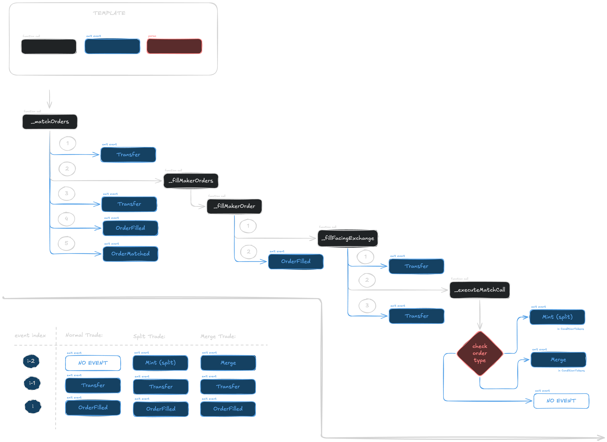

# Polymarket Insider Ranking

The Aim of this report is to create a framework for Ranking Polymarket Insiders based on their polymarket trading activity. 

## Data Prep

We will specifically utilize Dune Analytics `polymarket.trades` and `polymarket.market_details` tables. 
Polymarket enables prediction markets by creating YES/NO pair tokens that represent the outcome of a given question. There are two types of questions, CTF and Neg Risk.
CTF (Collateralized Trading Facility) contracts are used to resolve binary questions, while Neg Risk contracts are used to resolve non-binary multi-outcome questions.
`polymarket.trades` table is built from the `OrderFilled` events emitted by the Polymarket CTF and Neg Risk contracts, utilizing the `polymarket_details` table to map trade outcomes to market questions and other relevant metadata. 
```solidity
OrderFilled (
  index_topic_1 bytes32 orderHash,
  index_topic_2 address maker,
  index_topic_3 address taker,
  uint256 makerAssetId,
  uint256 takerAssetId,
  uint256 makerAmountFilled,
  uint256 takerAmountFilled,
  uint256 fee
)
```
Polymarket API itself is harder to scrape due to the vast size of the polymarket dataset. 
Between November 01, 2025 and April 28, 2026, a total of 1.03 Billion trades were recorded, by approximately 1.7 Million takers and makers.
The entire data is around 150GB in size, processing which on Dune Analytics on free tier is extremely slow and expensive, and borderline impossible with the 2 minute query limit.
Hence, we will use EDA and qualitative analysis to reduce the dataset size. 
The most common filter amongst existing literature is to ignore maker fills and only include full-order trades. 
In their research (Polymarket Volume Is Being Double-Counted)[https://www.paradigm.xyz/2025/12/polymarket-volume-is-being-double-counted], Storm Slivkoff noted that two kinds of `OrderFilled` events are emitted by the Polymarket CTF and Neg Risk contracts. When a user makes a market order, the `OrderFilled` event is emitted for both individual taker-maker fills and to the the complete order that is fulfilled. The two events can be distinguished by checking the `taker` field, which is the CTF or Neg Risk contract address for a full order. 
Adding this filter at a very early stage will remove some key signals within the dataset, that could be used, hence we will not ignore these events.
Furthermore, taker-maker fills can be put into 3 buckets: 
1. swap trades - trades where the YES/NO contract is traded directly, with USD exchanged
2. merge trades - where a between a maker and taker, one side provide YES and the other side provides NO, combine their YES and NO contracts to redeem USD and receive USD
3. split trades - where a maker and taker deposit USD, mint YES and NO pairs in equal numbers and one side receives YES and the other side receives NO. 
These however are not flagged by the Dune dataset. Moreover, these trades tend to show different data in the columns that what is expected. 
This is because, for a maker-taker trade, the `OrderFilled` event always emits the information wrt to the maker side. In the case of split and merge trades, this causes a discrepancy as the taker side is not present in the event data. Hence, some extra calculations based on some heuristics are needed to get the maker info of these fills. 
For these split and merge fills, we can obtain the correct taker asset by getting the info from the final `OrderFilled` event.
Since the `shares` required to redeem or mint YES/NO pairs are same, the split and merge fills always have the same amount of shares for the maker and taker. Since these assets are to be combined to redeem or mint, the price of the maker asset can be obtained as `(1-price)` where `price` is the asset price logged in the `OrderFilled` event. 
Using this, `(1 - price)` as the maker asset price, we can now calculate the usd volume of a fill as `shares * (1-price)` 



| label | trades | makers | takers |
--- | --- | --- | --- |
| 1. all trades | 1.03b | 1.73m | 1.68m |
| 2. ignore full-order trades | 646.81m | 812.92k | 1.68m |
| 3. shortlisted markets | 25.09m | 224.25k | 676.51k |
| 4. shortlisted markets (volume > $100k) | 18.30m | 191.86k | 609.31k |
