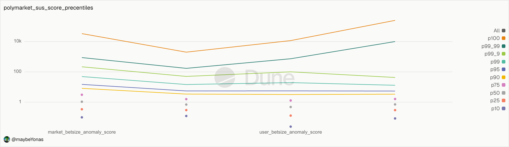

# Polymarket Insider Ranking

## 1. Introduction

The Aim of this report is to create a framework for Ranking Polymarket Insiders based on their polymarket trading activity derived completely from onchain data. The focus of this report is on whats onchain, as Polymarket access is restricted in my country of origin India. 

## TLDR

* Dune `polymarket.trades` and `polymarket.market_details` tables are used as the base raw dataset
* A combination of market filters and volume filters is applied to reduce dataset from 1.03 Billion to 18 million trades
* Quantitative signals are scores as `(value/p90) - 1` and capped at 99.9 percentile value
* 4 quantative signals: 
  * trade betsize vs market average - capped at 100
  * trade betsize vs user average - capped at 100
  * fills spread size vs market average - capped at 50
  * fills spread size vs user average - capped at 50
* 2 qualitative signals: 
  * fresh wallet trade - weight 25
  * contrarian trade - weight 75
* Further scoring based filtering reduces data from 18 million to 1.5 million suspicious trades

## 2. Data Prep

### 2.1. Understanding whats Onchain
We will specifically utilize Dune Analytics `polymarket.trades` and `polymarket.market_details` tables. 
Polymarket enables prediction markets by creating YES/NO pair tokens that represent the outcome of a given question. There are two types of questions, CTF and Neg Risk.
CTF (Collateralized Trading Facility) contracts are used to resolve binary questions, while Neg Risk contracts are used to resolve non-binary multi-outcome questions.
`polymarket.trades` table is built from the `OrderFilled` events emitted by the Polymarket CTF and Neg Risk contracts, utilizing the `polymarket_details` table to map trade outcomes to market questions and other relevant metadata. 
```solidity
OrderFilled (
  index_topic_1 bytes32 orderHash,
  index_topic_2 address maker,
  index_topic_3 address taker,
  uint256 makerAssetId,
  uint256 takerAssetId,
  uint256 makerAmountFilled,
  uint256 takerAmountFilled,
  uint256 fee
)
```


Other than just Polymarket being banned in my country, Polymarket API itself is harder to scrape due to the vast size of the polymarket dataset. 
Between November 01, 2025 and April 28, 2026, a total of 1.03 Billion trade entries were recorded, by approximately 1.7 Million takers and makers.
Processing this massive dataset without any initial filtering, on Dune Analytics on a free tier is extremely slow, expensive, and borderline impossible with the 2 minute query limit.


### 2.2. Initial Filtering
Since the data set is too large to process,we will use EDA and qualitative analysis to reduce the dataset size. 
We will employ a qualitative filter first, aiming to reduce the number of trades to process.
1. We first filter out markets that are likely to have high volume due to arbitrage. Markets that are trading on Crypto and Stock Prices, tend to follow oracle prices and consist of alot of arbitrage bots looking to trade inefficienies against external markets. These categories extremely have high volume and highly recurrent markets, inviting strong automations. Moreover, users can actively hedge positions across various venues to protect downside risk, thus making it harder to signal.
2. Markets that are trading on sports outcomes, tend to have strong volatility and follow live events closely. Live event data is the most important signal for these markets. Since the data utilized for this analysis is strictly onchain, the lack of access to offchain event data, that must be curated from dedicated APIs, is a significant effort. Thus, we will ignore these markets for the initial filter.
3. A sane $100K threshold for total volume processed is also used

We specifically ignore any market with one of the following tags:
```sql
[
  'Crypto Prices', 'Up or Down', 
  'Esports', 'Recurring', 
  'Games', 'Sports',
  'Tweet Markets'
]
```

Filtering for shortlisted markets with volume > $100k, gives us a 98% reduction in the number of trades.

| label | trades | makers | takers |
--- | --- | --- | --- |
| 1. all trades | 1.03b | 1.73m | 1.68m |
| 2. ignore full-order trades | 646.81m | 812.92k | 1.68m |
| 3. shortlisted markets | 25.09m | 224.25k | 676.51k |
| 4. shortlisted markets (volume > $100k) | 18.30m | 191.86k | 609.31k |

### 2.3. Cleaning Dune Polymarket Trades
The most common filter amongst existing literature is to ignore maker fills and only include full-order trades. 
This has its origins from Paradigm's research [Polymarket Volume Is Being Double-Counted](https://www.paradigm.xyz/2025/12/polymarket-volume-is-being-double-counted), where Storm Slivkoff noted that two kinds of `OrderFilled` events are emitted by the Polymarket CTF and Neg Risk contracts. When a user makes a market order, the `OrderFilled` event is emitted for both individual taker-maker fills and to the the complete order that is fulfilled. The two events can be distinguished by checking the `taker` field, which is the CTF or Neg Risk contract address for a full order. 
This filter, when added at a early stage of the data cleaning process, would remove maker-taker fills. These fills are extremely valuable, as they contain individual taker-maker fills that can be utilized to calculate the spread of a trade thats realized by the taker. The spread can be calulated as the difference between the min price and max price of the all the taker fills. A quick sanity check is performed on the spread to ensure that spread is always positive.

Furthermore, taker-maker fills can be put into 3 buckets: 
1. **Swap trades** - trades where the YES/NO contract is traded directly, with USD exchanged
2. **Merge trades** - where a between a maker and taker, one side provide YES and the other side provides NO, combine their YES and NO contracts to redeem USD and receive USD
3. **Split trades** - where a maker and taker deposit USD, mint YES and NO pairs in equal numbers and one side receives YES and the other side receives NO. 

These however are not flagged by the Dune dataset. Moreover, these trades tend to show different data in the columns that what is expected. 
This is because, for a maker-taker trade, the `OrderFilled` event always emits the information wrt to the maker side. In the case of split and merge trades, this causes a discrepancy as the taker side is not present in the event data. Hence, some extra calculations based on some heuristics are needed to get the maker info of these fills. 
For these split and merge fills, we can obtain the correct taker asset by getting the info from the final `OrderFilled` event.
Since the `shares` required to redeem or mint YES/NO pairs are same, the split and merge fills always have the same amount of shares for the maker and taker. Since these assets are to be combined to redeem or mint, the price of the maker asset can be obtained as `(1-price)` where `price` is the asset price logged in the `OrderFilled` event. 
Using this, `(1 - price)` as the maker asset price, we can now calculate the usd volume of a fill as `shares * (1-price)`. 
We can sanity check this by aggregating the maker usd volume of all fills and comparing it to the volume of all full order fills, ensuring it matches.

### 2.4. Initial trade labelling
With Polymarket Airdrop speculation in mind, there are two main types of trades, that can be filtered, where directionality is inconsequential and the trader is trading on the inefficiency for before the market reaches a resolution. These are:
1. **Notional Farming** - Trades where users buy shares close to 0 price. This pumps up their notional volume in exchange for small USD volume. eg: buying 100000 YES shares at 0.0001 price for 100 USD. 
2. **Yield Farming** - Traders where users buy shares close to 1 price. This captures the small difference between the market price and resolution price. eg: buying 100000 YES shares at 0.98 price for 98000 USD and booking 2000 USD profit upon redemption.

For our analysis, we will label a trade as : 
1. **Notional Farming** - If the trader buys Tokens priced under 0.05 at most 48 hours before resolution in the opposite direction of resolution (i.e if "YES" is bought and final outcome is "NO")
2. **Yield Farming** - If the trader buys Tokens priced over 0.95 at most 48 hours before resolution in the same direction of resolution (i.e if 'YES" is bought and final outcome is "YES")

This labelling helps label around 50% of the trades in these price ranges.


## 3. Signals 

Inorder to label potential insider traders, we will use the following well-known signals and aggregate them to score each trade and eventually aggregate it per trader. Once again, we can use qualitative and quantitative signals to score each trade.
We will go with well-known qualitative signals such as: 
* **Fresh wallet Trade** - A trade that is made by a new wallet
* **Contrarian Trade** - A trade that is made against the prevailing market trend

On the quantitative side, we will go with:
* **Betsize anomaly** - Trades where the size of the position is an outlier when compared to a subset of the trades in the same market or same user
* **Spread anomaly** - Trades where the spread is an outlier when compared to a subset of the trades in the same market or same user

We will define these signals as follows:
* **Fresh wallet trade** - A trade made within the first 24 hours of a wallet's first trade. Since our dataset is focussing on data after Nov 2025, we add a extra filter to ensure trades made in November are all not logged as fresh wallet trades. We do this by selectively ignoring first trades before 20th November 2025.
* **Contrarian trade** - A trade made atmost 24 hours before the resolution of a market, that is either a BUY trade below 0.4 in the direction of resolution of the market or a SELL trade above 0.7 in the direction opposite to the resolution of the market.
* **Bet size anomaly** - We define two kinds of anomaly, one with respect to the market and one with respect to the user, i.e how a trade betsize compares to other traders in the same market or trades by the same user. In both cases, we will use measures of central tendency (median, 90th percentile) and dispersion (quartile ranges) to define the anomaly threshold and also quantify it. To quantify the anomaly, first we define p90 percentile as the threshold. Since trading tends to be extremely right skewed, we then measure how many times p90 percentile, does the actual betsize exceed the p90 percentile. If the actual betsize is `x` and `[x1 ... xn]` is all the betsizes in a market or user partition, then the anomaly score is
  ```
  (x / p90_percentile([x1 ... xn])) - 1
  ```
* **Spread size anomaly** - A similar anomaly score is computed for the spread size of a trade. Since spread size contains a lot of zero values, we particularly filter for only non-zero values when computing the anomaly score. A sanity filter to only consider values higher than 1e6 is applied to avoid values smaller than USDC decimals, arising from float precision issues. If the actual spread size is `x` and `[x1 ... xn]` is all the spread sizes in a market or user partition, then the anomaly score is
  ```
  (x / p90_percentile([x1 ... xn] where xi > 0)) - 1
  ```

Thus we have 2 qualitative signals:
1. `fresh_wallet_trade`
2. `contrarian_trade`
And 4 quantitative signals:
1. `market_betsize_anomaly_score`
2. `user_betsize_anomaly_score`
3. `market_spread_anomaly_score`
4. `user_spread_anomaly_score`


#### 3.1 Why `z-score` was not utilized ? 
`z-score` was not utilized because it assumes a normal distribution of data. Both bet-size and spread size are extremely right skewed, so `z-score` is not a suitable measure for these variables.
A more robust alternative such as MAD (Median Absolute Deviation) based z-score was explored. However the underlying Dune-SQL doesn't have a built in function and hence calculating MAD based z-score would require multiple passes over the data, increasing computing time.

#### 3.2 Why no `PNL` signal?
PNL was another frequently used signal by other literatures. Existing work to rebuild PnL from onchain data (eg [blackhamm3r query](https://dune.com/queries/7440670)) create PNL from trade data by aggregating USD flow and PayoutRedemption values. A quick sanity check, is to compute per trader shares balances from these trades and check for negative values. Since Polymarket stores YES/NO positions separately in the form of ERC 1155, these positions can never be negative.

Example:

Lets check the trades posted by `0xce296aaf92ecc022cc6608a54c622bb1c445b71b` in the `Will Gemini 3.0 be released on November 17 2025?` market.

| key | value |
| --- | --- |
|market name|Will Gemini 3.0 be released on November 17 2025?|
|condition id|0x45932bc66b00af152e158b1f4c916d9f1e7639b5641c7e8c2a6901a7efa905a9|
| YES token | 46687945077176076830096477597797725250961514733182621481405351828163193903577 | 
| NO token | 113016318552201794810557514937858326971831314187777686552865771003364240784846 |

Lets consider the first 5 trades 

| maker_asset |	delta |	balance |	direction | 
| - | - | - | - |
113016318552201794810557514937858326971831314187777686552865771003364240784846 |	362.104711 |	362.104711 |	BUY |
113016318552201794810557514937858326971831314187777686552865771003364240784846 |	-100 |	262.104711 |	SELL |
113016318552201794810557514937858326971831314187777686552865771003364240784846 |	-100 |	162.104711 |	SELL |
113016318552201794810557514937858326971831314187777686552865771003364240784846 |	-162.1 |	0.004711 |	SELL |
46687945077176076830096477597797725250961514733182621481405351828163193903577	| **-100**	|	-100 | SELL |

You can see how the wallet sells `YES` token, when it never bought it. Turns out unaccounted by other research pieces, a wallet can get `NO` exposure by depositing USD, minting `YES` + `NO` pair and then market selling `YES` tokens. The fix looks straightforward at first, as you need to track ERC1155 transfers instead of trades. However this creates a couple of major complications: 
1. ERC1155 have `batchTransfers` which need to be unwrapped, involving a cross join. This increases computational expense, esp alot of the markets we focus on are NegRisk, with multiple options and multiple YES/NO pairs transfered in a single batch. 
2. Tracking ERC1155 transfers only gives us the balance at resolution or at any chose instant. However, to calculate PnL we still need trades to compute invested amounts and realized profits. This means combining two 100+ GB datasets, and potentially joining them. Since these combined data need to be further combined with other datasets for aggregations, this would creap up the compute expense extremely. 

For these two reasons, we will be avoiding PnL based signals.

## Building Composite Score

We need to combine the signals into a single composite score to compare different trades. We have few problem with combining these signals:
1. The quantitative signals have their own ranges, and our focus is on the outliers, hence we cannot perform simple normalization using averages or median.
2. We have two binary qualitative signals, hence they need to be combined with quantitative signals and hence require a solid weight.

Since each trade can be insider trade, we score each trade individually. We can then perform secondary aggregation to compute a wallet rank.
For each trade, we compute the individual signals and flag the contrarian and fresh wallet trades.
We now use this to filter out trades that do not have any anomalous signals. This reduces the trades count to a more manageable 1.84 million trades.
Now, we can analyze the distribution of these trades to come up with weights and caps for the composite score.

Analyzing the distribution of the quantitative scores, we notice that the distribution is zero-heavy. To prevent zero scores from affecting outliers, we ignore these scores when determiningg a cap for the quantitative scores.



We choose values between P99 and P99.9 for the quantitative score cap.
Since we are going with 99 and 99.9 percentile caps, atmost we cap a maximum of 2000 to 20000 trades in the dataset.
For both market anomalies, we restrict cap to 100 points.
For both user anomalies, we restrict cap to 50 points.
We score any fresh wallet trade as 25 points.
We score any contrarian trade as 75 points.

This gives a composite score cap of max 100 + 100 + 50 + 50 + 25 + 75 = 400 points for the most anomalous trades. However, this anomaly combination is rarely reached in the dataset, with the most anomalous trade scoring 200 points. 

When scoring users by aggregating their trades, we add an extra filter, where the score is summed, only if it was a winning trade, i.e the trade is made in the direction of the resolved outcome. 
However, summing up the scores alone wouldn't allow us zero in on the anomalous traders, as this score is now strongly correlated with the volume of trading by the user. 
To combat this, we find the P99 percentile value for the user as the user's score. This way, anomalous traders with low volume would have their highest scored trade as the score, while highly active traders, would have their score scaled down by the volume of their low scoring trades. 

We thus score 1.84 Million trades, and 54,478 unique wallets. 

## 4. Insights

Let us now explore, how our framework labels insiders with a few case studies.  

### 4.1. Known Insiders

#### 4.1.1. AlphaRacoon - Google Insider

AlphaRacoon was a recently convicted Insider, known for making 1M USD profits by betting on Google Gemini release date and most recently on **“#1 Searched Person on Google this year?"**, where they accurately predicted **d4vd** to be the winner, along with betting **NO** on the markets of other potential candidates.

The wallet address is `0xee50a31c3f5a7c77824b12a941a54388a2827ed6`.
In the wallet ranking, their wallet was ranked **652nd** with a P99 score of **101.55**.

Ranking the top 5 trades:
|Question                                                                                                                                                                     |Shares   |Price|USD betsize|Bet|Outcome|Score |
|-----------------------------------------------------------------------------------------------------------------------------------------------------------------------------|---------|-----|-----------|---|-------|------|
|[What day will Gemini 3.0 be released?](https://polymarket.com/event/what-day-will-gemini-3.0-be-released?)                                                                  |35,034.55|0.887|$ 31,080.78|No |no     |101.56|
|[What day will Gemini 3.0 be released?](https://polymarket.com/event/what-day-will-gemini-3.0-be-released?)                                                                  |38,690.04|0.687|$ 26,574.70|Yes|yes    |96.11 |
|[What day will Gemini 3.0 be released?](https://polymarket.com/event/what-day-will-gemini-3.0-be-released?)                                                                  |21,298.64|0.697|$ 14,851.00|Yes|yes    |52.88 |
|[What day will Gemini 3.0 be released?](https://polymarket.com/event/what-day-will-gemini-3.0-be-released?)                                                                  |18,215.78|0.636|$ 11,581.18|Yes|yes    |40.96 |
|[will-luigi-mangione-rank-in-googles-top-5-most-searched-people-of-2025](https://polymarket.com/event/will-luigi-mangione-rank-in-googles-top-5-most-searched-people-of-2025)|18,544.35|0.815|$ 15,122.12|No |no     |30.02 |

#### 4.1.2. Venezuela president Maduro

On January 3, 2026, US President Trump announced the capture of Venezuela's president Maduro in a military operation **"Operation Absolute Resolve"** the previous midnight. Since this was an executive move, no public info was available before President's address. However, a cluster of wallets were reported to have made bets on markets on when the president of Venezuela was to be removed from tenure, a few hours before the President's address.

* `0x31a56e9E690c621eD21De08Cb559e9524Cdb8eD9`
* `0xa72DB1749e9AC2379D49A3c12708325ED17FeBd4`
* `0x6baf05d193692bb208d616709e27442c910a94c5`
* `0x168b100d7a6620a2f49a455344c2c006eaf1714b`

##### `0x31a56e9E690c621eD21De08Cb559e9524Cdb8eD9` 

This wallet was owned by active-duty Army Special Forces Sergeant Gannon Ken Van Dyke, who was arrested in violation of Commodity Exchange Act. 
The wallet's is ranked **2612** with a P99 score of **65.50**.

Top 5 trades by score of `0x31a56e9E690c621eD21De08Cb559e9524Cdb8eD9`:
|Question                                                                                                                                                         |Shares   |Price|USD betsize|Bet|Outcome|Score|
|-----------------------------------------------------------------------------------------------------------------------------------------------------------------|---------|-----|-----------|---|-------|-----|
|[maduro-out-by-january-31-2026-318](https://polymarket.com/event/maduro-out-by-january-31-2026-318)                                                              |88,186.77|0.082|$ 7,215.00 |Yes|yes    |64.50|
|[maduro-out-by-january-31-2026-318](https://polymarket.com/event/maduro-out-by-january-31-2026-318)                                                              |87,500.00|0.080|$ 7,000.00 |Yes|yes    |64.01|
|[maduro-out-by-january-31-2026-318](https://polymarket.com/event/maduro-out-by-january-31-2026-318)                                                              |82,420.83|0.073|$ 6,000.00 |Yes|yes    |61.86|
|[maduro-out-by-january-31-2026-318](https://polymarket.com/event/maduro-out-by-january-31-2026-318)                                                              |90,347.29|0.066|$ 6,000.00 |Yes|yes    |61.86|
|[trump-invokes-war-powers-against-venezuela-by-january-31-134-583](https://polymarket.com/event/trump-invokes-war-powers-against-venezuela-by-january-31-134-583)|2,533.13 |0.039|$ 100.00   |Yes|yes    |50.97|

##### `0xa72DB1749e9AC2379D49A3c12708325ED17FeBd4`

This wallet is ranked **1243** with a P99 score of **86.39**.

This wallet only has a single trade: 
|Question                                                                                           |Shares   |Price|USD betsize|Bet|Outcome|Score|
|---------------------------------------------------------------------------------------------------|---------|-----|-----------|---|-------|-----|
|[maduro-out-by-january-31-2026-318](https://polymarket.com/event/maduro-out-by-january-31-2026-318)|80,764.94|0.072|$ 5,782.66 |Yes|yes    |86.40|

##### `0x6baf05d193692bb208d616709e27442c910a94c5`

This wallet is ranked **102** with a P99 score of **126.19**.

This wallet has only 3 trades:
|Question                                                                                                                                 |Shares   |Price|USD betsize|Bet|Outcome|Score |
|-----------------------------------------------------------------------------------------------------------------------------------------|---------|-----|-----------|---|-------|------|
|[maduro-out-by-february-28-2026](https://polymarket.com/event/maduro-out-by-february-28-2026)                                            |82,276.39|0.183|$ 15,089.94|Yes|yes    |126.19|
|[maduro-out-by-january-31-2026-318](https://polymarket.com/event/maduro-out-by-january-31-2026-318)                                      |88,433.40|0.113|$ 10,000.00|Yes|yes    |97.69 |
|[khamenei-out-as-supreme-leader-of-iran-by-january-31](https://polymarket.com/event/khamenei-out-as-supreme-leader-of-iran-by-january-31)|20,000.00|0.200|$ 4,000.00 |Yes|no     |0     |

##### `0x168b100d7a6620a2f49a455344c2c006eaf1714b`

The wallet is ranked **1273** with a P99 score of **85.13**.

This wallet has only 2 trades:
|Question                                                                                           |Shares   |Price|USD betsize|Bet|Outcome|Score|
|---------------------------------------------------------------------------------------------------|---------|-----|-----------|---|-------|-----|
|[maduro-out-by-january-31-2026-318](https://polymarket.com/event/maduro-out-by-january-31-2026-318)|44,295.28|0.117|$ 5,187.86 |Yes|yes    |85.12|
|[maduro-out-by-january-31-2026-318](https://polymarket.com/event/maduro-out-by-january-31-2026-318)|37,774.85|0.125|$ 4,709.81 |Yes|yes    |84.10|

#### 4.1.3. ZachXBT Investigation on Axiom:

On February 23, 2026, ZachXBT a renowned onchain investigator posted a tweet stating a major insider trading operation would be exposed on February 26, 2026. The Polymarket Market betting on which company would be exposed was deployed and gained traction. Initially, Meteora a popular DEX on Solana was favourite to be the target of the investigation, with 43% implied by the market, with Axiom sitting second at 13%. 
On 26th, ZachXBT announced Axiom employee, Broox Bauer led a insider trading operation, leveraging on internal tools to access private trading data. The following traders were noted to have entered markets at low price and walked away with combined 1.4 million USD in profits.

|Trader                                    |USD Volume  |P99 Percentile|Rank|
|------------------------------------------|------------|--------------|----|
|0xe56526b27b96f009b31ddb46558a134047bfce48|$ 100,500.00|125.00        |142 |
|0x054ec2f0ccfdae941886a3ed306635068c716639|$ 692,243.85|102.15        |592 |
|0x581f34349babaf03b2d3c8f5f60cf44ffbe19a3a|$ 4,978.05  |86.93         |1230|
|0x98a96619e482700e83e8486e4f3727dba17f5381|$ 19,117.34 |86.08         |1253|
|0x5e524f43357198fa815e6766f02fe686b444b064|$ 16,247.87 |76.45         |1745|
|0xeeff2d748ad5efcfbbb3c8858f608d6b6321a398|$ 10,383.47 |57.28         |3261|
|0x1d9af60c679cd0b577c3c4ccb4b1a4be4174426d|$ 15,294.80 |57.10         |3283|
|0xff55beaf369387d7748a31213699a51f1ca8b877|$ 10,000.00 |55.11         |3572|
|0x6d6affce1ed04a0e9611484daf1cef5cbcf3fb40|$ 4,947.75  |36.56         |9211|
|0xd9eab53eaba81333045da5bd84ce6c833f721e89|$ 3,892.82  |36.02         |9528|

The top two wallets specifically:

Top 5 trades of `0xe56526b27b96f009b31ddb46558a134047bfce48`:
|Question                                                                                                                                                   |Shares   |Price|USD betsize|Bet|Outcome|Score |
|-----------------------------------------------------------------------------------------------------------------------------------------------------------|---------|-----|-----------|---|-------|------|
|[Which crypto company will ZachXBT expose for insider trading?](https://polymarket.com/event/which-crypto-company-will-zachxbt-expose-for-insider-trading?)|3,371.06 |0.297|$ 1,000.00 |Yes|yes    |76.60 |
|[Which crypto company will ZachXBT expose for insider trading?](https://polymarket.com/event/which-crypto-company-will-zachxbt-expose-for-insider-trading?)|34,447.28|0.290|$ 10,000.00|Yes|yes    |99.98 |
|[Which crypto company will ZachXBT expose for insider trading?](https://polymarket.com/event/which-crypto-company-will-zachxbt-expose-for-insider-trading?)|13,063.86|0.765|$ 10,000.00|No |no     |76.63 |
|[Which crypto company will ZachXBT expose for insider trading?](https://polymarket.com/event/which-crypto-company-will-zachxbt-expose-for-insider-trading?)|18,763.31|0.799|$ 15,000.00|No |no     |99.94 |
|[Which crypto company will ZachXBT expose for insider trading?](https://polymarket.com/event/which-crypto-company-will-zachxbt-expose-for-insider-trading?)|31,252.06|0.800|$ 25,000.00|No |no     |125.00|

Top 5 trades of `0x054ec2f0ccfdae941886a3ed306635068c716639`:
|Question                                                                                                                                                   |Shares   |Price|USD betsize|Bet|Outcome|Score |
|-----------------------------------------------------------------------------------------------------------------------------------------------------------|---------|-----|-----------|---|-------|------|
|[Which crypto company will ZachXBT expose for insider trading?](https://polymarket.com/event/which-crypto-company-will-zachxbt-expose-for-insider-trading?)|34,720.90|0.288|$ 10,000.00|Yes|yes    |102.15|
|[Which crypto company will ZachXBT expose for insider trading?](https://polymarket.com/event/which-crypto-company-will-zachxbt-expose-for-insider-trading?)|33,453.55|0.299|$ 10,000.00|Yes|yes    |99.98 |
|[Which crypto company will ZachXBT expose for insider trading?](https://polymarket.com/event/which-crypto-company-will-zachxbt-expose-for-insider-trading?)|6,806.95 |0.294|$ 2,000.00 |Yes|yes    |82.06 |
|[Which crypto company will ZachXBT expose for insider trading?](https://polymarket.com/event/which-crypto-company-will-zachxbt-expose-for-insider-trading?)|10,066.02|0.298|$ 3,000.00 |Yes|yes    |81.80 |
|[Which crypto company will ZachXBT expose for insider trading?](https://polymarket.com/event/which-crypto-company-will-zachxbt-expose-for-insider-trading?)|17,664.84|0.283|$ 5,000.00 |Yes|yes    |89.26 |
|[Which crypto company will ZachXBT expose for insider trading?](https://polymarket.com/event/which-crypto-company-will-zachxbt-expose-for-insider-trading?)|16,672.73|0.300|$ 5,000.00 |Yes|yes    |86.99 |

A wallet that made amost 600% ROI - `0x1d9af60c679cd0b577c3c4ccb4b1a4be4174426d` 
|Question                                                                                                                                                   |Shares   |Price|USD betsize|Bet|Outcome|Score|
|-----------------------------------------------------------------------------------------------------------------------------------------------------------|---------|-----|-----------|---|-------|-----|
|[Which crypto company will ZachXBT expose for insider trading?](https://polymarket.com/event/which-crypto-company-will-zachxbt-expose-for-insider-trading?)|19,853.02|0.101|$ 2,000.00 |Yes|no     |0    |
|[Which crypto company will ZachXBT expose for insider trading?](https://polymarket.com/event/which-crypto-company-will-zachxbt-expose-for-insider-trading?)|21,387.24|0.146|$ 3,118.94 |Yes|yes    |57.10|
|[Which crypto company will ZachXBT expose for insider trading?](https://polymarket.com/event/which-crypto-company-will-zachxbt-expose-for-insider-trading?)|3,062.75 |0.132|$ 404.89   |Yes|yes    |25.05|
|[Which crypto company will ZachXBT expose for insider trading?](https://polymarket.com/event/which-crypto-company-will-zachxbt-expose-for-insider-trading?)|62,644.10|0.080|$ 5,000.00 |Yes|yes    |37.92|
|[Which crypto company will ZachXBT expose for insider trading?](https://polymarket.com/event/which-crypto-company-will-zachxbt-expose-for-insider-trading?)|4,642.27 |0.118|$ 550.00   |Yes|yes    |26.22|

## 4.2. Potential Insiders

These are likely insiders that have not been detected publicly.

## 5. Future Scope:

#### 5.1. Improving Markets and Decision filters. 

One of the top 10 trades by our composite score is a **"Nuclear weapon detonation by June 30?"** trade that buys `NO` tokens for 20,000 USD. A trade that receives 176 points


| point type |	points | 
| - | - |
| market_betsize_anomaly_score | 100 |
| user_betsize_anomaly_score | 50 |
| market_spread_anomaly_score | 1 |
| user_spread_anomaly_score | 0 |
| fresh_wallet_trade | 25 |
| contrarian_trade | 0 |
| total | 176 |

This is a trade, that could be have been filtered, if we had better filters in place for Market Decision combos. A better filter would have been where:
1. A `NO` buy on **"Nuclear weapon detonation by June 30?"** is more likely to be a non-insider trade
2. A `YES` buy on **"Nuclear weapon detonation by June 30?"** is more likely to be an insider trade

In this project, this was a more manual effort, where individual markets need to be inspected and decision needs to be made on a market-by-market basis. 
Once can also argue that, an insider could buy a `NO` token on the same market, when they know for sure there is no likelyhood of Nuclear Launch.

#### 5.2. Past trading context

Currently the scoring is completely based on the current trade. Due the size of the dataset, injecting past context into the trade is too expensive at this stage. A simple flag to indicate whether the new trade is increasing the position of the user, and score to quantify the size this increase with respect to the user's previous trades and user's existing position is a strong measure for the user's conviction.
The opposite of this, can be used to measure how much a user's conviction decreased.

This would have been a very handy measurement in the Nuclear weapon market, where an insider believes there is no likelyhood of Nuclear Launch, gauging the conviction of the insider. Moreover, users switching from `YES` to `NO` on the same market in a short period is another strong signal that can be built using past trading context.

#### 5.3. More robust statistics

We currently use measures of central tendency to measure outliers. However, these measures are mostly used to detect outliers than to score them.
Moreover, we use quantile based capping to cap the outliers. Using better alternatives to scale outliers would be more appropriate. 
A solution, that was explored, but was eventually dropped, due to computational constraints. We could find appropriate lower thresholds of score, above which we can definitively that the score is an outlier. From there we can perform quantile scaling with some logarithmic components so the so extremely outliers are scaled down.

Other than improving outlier score, a more robust framework for weighting different score is also important. Some late EDA on the scores showed that betsize anomalies were more frequently occuring than spread anomalies. Similarly user anomalies were more frequent than market anomalies. This could be an artifact of the standardized scoring utilized for scoring the anomalies. Care could be taken to tweak the scoring frameworks for a more evenly weighted scoring across different metrics.

#### 5.4. Market clustering

One of the most high profile cases in Polymarket insider trading, was **AlphaRacoon** the Google insider, who made close to 1 Million USD in profits betting on Google related markets. A majority of their profits came from taking positions on a cluster of markets that pointing to the same outcome. 

The question was **"#1 Searched Person on Google this year?**. AlphaRacoon placed bets on **d4vd** `YES` and then proceeded to buy `NO` on **Trump**, **Pope Leo XIV**, **Bianca Censori** and **Zohran Mamdani**. The **d4vd** market resolved to `YES` and other to `NO`, booking the user insane profits.

In our current dataset, each of these markets are treated separately. However, these 5 markets are part of the same question, and derived from same insider information.

#### 5.5. Wallet clustering

Along with trades scored individually, we also score user's independantly. However, it has been noted that **“Which company will ZachXBT expose?”** contained clusters of wallets, who had relatively smaller trade sizes, but made trades in similar timestamps, arising sybil suspicion. 
Clustering can be performed on clustered markets to identify wallet clusters. Bet sizes, trade timestamps, onchain source of funds are key features than can be used to cluster wallets and detect communities. 

#### 5.6. External data

Onchain data has been used successfully by alot of DeFi projects to counter sybils and other malicious actors. Data such as date of first transaction, source of funds, prior DeFi experience have been utilized to score risker wallet and clusters. These could have been valuable signals while flagging insider trades.

A lot of markets were ignored due to their reliance on external API data for resolution. These also include markets, that can contain insider trading without explicitly depending on resolution. 

An example market is the Tweets market. Tweets markets are Neg-risk markets, where multiple ranges are traded. This leads to cases where, for example **Elon Musk # tweets February 10 - February 17, 2026? - 200-219** market would only resolve at the end of February 17, 2026. But the 219 count would have reached sometime around February 13th, 2026.

## References:

* [Polymarket Volume Is Being Double-Counted - Storm Slivkoff - Paradigm](https://www.paradigm.xyz/2025/12/polymarket-volume-is-being-double-counted)
* [U.S. Soldier Charged With Using Classified Information To Profit From Prediction Market Bets - Office of Public Affairs](https://www.justice.gov/opa/pr/us-soldier-charged-using-classified-information-profit-prediction-market-bets)
* [Polymarket bettors put $3 million on which crypto firm ZachXBT will expose next - Coindesk](https://www.coindesk.com/markets/2026/02/24/polymarket-bettors-put-usd3-million-on-which-crypto-firm-zachxbt-will-expose-next)
* [Insiders cashed in before Axiom reveal, Wallets bagged $1M on Polymarket](https://www.cryptopolitan.com/insiders-cashed-in-before-axiom-reveal-wallets-bagged-1m-on-polymarket)
* [Google Employee Charged With Insider Trading](https://www.justice.gov/usao-sdny/pr/google-employee-charged-insider-trading)
