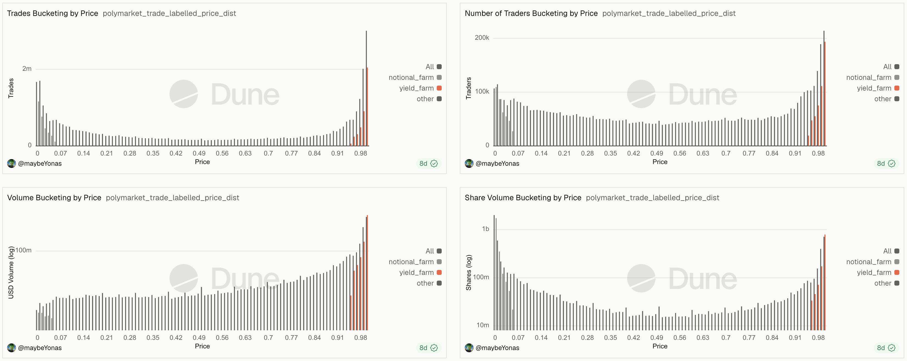

# Polymarket Insider Trading Detection

This report presents a framework to detect and rank potential insider trading activites on Polymarket, using only public onchain data. The analysis covers trades between November 1, 2025 and April 28, 2026. 

The framework is to be used as means of filtering for priority trades, that potentially require investigation. The framework is used to rank trades and traders based on concentration of specific signals, which are indicative of insider trading.

## 1. Problem

Insider trading is defined as trading by individuals who have non-public information about an event, that can be used to gain an unfair edge over other traders. 
The Commodity Futures Trading Commission (CFTC) regulates trading of commodity futures, options, and swaps, and refers to the Commodity Exchange act as the legal framework with regards to dealing with insider trading in Equity Markets. 
As of now, there is no formal legal frameword for insider trading with respect to Prediction markets, except for a few exceptions. 
Patters and Outliers can be utilized to detect naive insider trading behaviour such as: large position sizing relative to market, contrarian bet entries at low prices that pay out, fresh wallets, sweeping existing liquidity and moving mid-price in the orderbook   

## 2. Goal

Using the framework, we aim to:
1. Estimate the likelihood a given trade is an insider trade, or a traders potentially trading based on privileged information.
2. Use only onchain data as source of truth, since API data could be altered in future
3. Produce a ranking by building a composite score from multiple signals

## 3. Scope

### 3.1. Timeframe

Only trades that fall within November 1, 2025 and April 28, 2026, are analyzed. April 28, 2026 isn't arbitrary, its the end of v1 deployment of the Polymarket smart contracts. Thus, all trades analyzed will be that of v1 only.

A buffer is applied when calculating a wallet's first trade: wallets with their first trade before November 20, 2025 are not flagged as **"fresh wallet"**, to avoid false positives from the dataset starting cut off.

### 3.2. Markets

We only focus only on markets that were created after November 1, 2025 and resolved before April 28, 2026. Thus, it extends that all trades analyzed, fall within this timeframe, and for any market in this choosen timeframe, all trades are analyzed or no trades are analyzed.

Not all markets are analyzed. Markets with high structural noise and recurring patterns, those where automation and systematic trading dominates, are excluded from the analysis. Markets with the following tags are excluded:

| Tag Excluded | Reason for Exclusion |
|---|---|
| Prices Up or Down | Price Oracle driven markets, dominated by arbitrage bots hedging against external venues |
| Sports / Esports | Require live event data thats unavailable in onchain sources, along with high volatility to events |
| Recurring Markets | Repetitive markets like weather and spotify top songs, with strong automation incentives |
| Tweet Markets | Resolution relies on external event counts, with questions settling days before market is resolved |

These exclusions do not indicate that insider trading is absent. Its a decision to limit scope due to constraints of the dataset.

### 3.3. Volume

Markets with volum less than 100,000 USD are excluded, so that focus is on the liquid markets, inorder to prevent liquidity issues from polluting the signals. 
Low liquidity reduces large market orders, while also increasing number of trades pushing the mid-price in orderbook.

Applying these exclusions, the dataset reduces to 2% of the original size.


| label | trades |
--- | --- |
| all trades | 1.03b |
| shortlisted markets | 25.09m |
| shortlisted markets (volume > $100k) | 18.30m |

## 4. Dataset

### 4.1. Data Source
The primary data sources are two Dune Analytics Curated Tables:

| Table | Contents |
|---|---|
| [`polymarket.market_trades`](https://dune.com/data/polymarket_polygon.market_trades) | All `OrderFilled` events emitted by Polymarket CTF and Neg Risk contracts, that include trade details such as token, price, market details |
| [`polymarket.market_details`](https://dune.com/data/polymarket_polygon.market_details) | Metadata for Polymarket prediction markets, including event/market names, questions, outcome tokens, resolution status, and oracle details |

### 4.2. Full-Order vs Fill-Order

Polymarket emits two distinct `OrderFilled` events per trade indexed onchain. 

Event schema:
```solidity
OrderFilled (
  index_topic_1 bytes32 orderHash,
  index_topic_2 address maker,
  index_topic_3 address taker,
  uint256 makerAssetId,
  uint256 takerAssetId,
  uint256 makerAmountFilled,
  uint256 takerAmountFilled,
  uint256 fee
)
```

1. **Fill Order**: One event for each individual taker-maker pair that fills a part of the order. The maker is the owner of order in the orderbook, and taker is the counterparty filling the order in orderbook. 
2. **Full Order**: One event aggregating the the complete order of a taker. However a key distinction, the taker field contains the CTF or Neg Risk contract, and the maker is the actual taker wallet. 

A common pre-processing step in existing works is to remove fill-level events and only retain full-order events. This was discovered by Paradigm Data Partner Slivkoff, and is used to avoid double counting when calculating metrics like volume. 

In our analysis, we retain the fill-orders, as they are used to compute realized spread, the price difference between the fills in a single taker order, which can be used as a signal to detect liquidity sweeps. 

Flow of control in contract:


### 4.3 Split and Merge trades

Also pointed out by Paradigm Data Partner Slivkoff, fill-order events can represent 3 types of trade:

- **Swap**:  A standard exchange of YES/NO tokens between the maker and taker, in exchange for USD.
- **Split**: A taker and maker jointly deposit USD, and receive same amount of YES/NO tokens respectively.
- **Merge**: A taker and maker jointly deposit same amount of YES/NO tokens, and receive USD.

In our EDA, we found that split and merge trades `OrderFilled` events emits info from the maker's perspective, i.e only maker's token ID and maker's price is indexed. The taker's token ID is constructed from the full order `OrderFilled` event associated with the transaction, and the taker's price is computed as \(1 - p_{\text{maker}}\) (since, YES and NO are complementary tokens, the sum to 1 USD). 

Since the shares remain constant, the USD volume of the taker's fill can be computed as:

\[\text{USD volume} = \text{shares} \times (1 - p_{\text{maker}})\]

We can sanity check this formula to verify our Split and Merge labelling, by comparing the aggregate sum of maker USD volume for fill-orders with the aggregate sum of taker USD volume for full-orders.

## 5. Confounder labelling

Before we apply heuristics, we filter trades likely non-directional, and optionally excluded from scoring. 

### 5.1 Notional Farming

Notional Farming is buying large amount of shares at prices close to zero. This inflates notional volume, with hopes that notional volume would be a major component for a potential Polymarket Airdrop. A trade is labelled notional farming if:
* trader buys tokens priced **below 0.05**
* the trade occurs at most 48 hours before resolution
* trade is in the **opposite** direction of the market (i.e. buy a YES when market is going to resolve to NO, or vice versa)

### 5.2 Yield Farming

Yield Farming is buying near-certain outcomes at prices close to 1 to capture small residual inefficiencies prior to resolution. A trade is labelled yield farming if:
* trader buys tokens priced **above 0.95**
* the trade occurs at most 48 hours before resolution
* trade is in the **correct** direction of the market (i.e. buy a YES when market is going to resolve to YES, or vice versa)

This labelling helps label around 50% of the trades in these price ranges.


## 6. Detection Heuristics

Six heuristics are used to detect potential insider trades - two qualitative and four quantitative.

### 6.1. Qualitative Heuristics - Trade Label

#### H1: Fresh Wallet Trade

**Intuition**: Insiders often use new wallets to avoid tying their suspicious trades to their identity. 

**Definition**: A trade is a fresh wallet trade, if it occurs within the first 24 hours of the wallet's first trade. Wallets whose first trade is before November 20, 2025 are exempt, to prevent the dataset starting cutoff from generating too many false positives.

**False positives**: A new legitimate wallet's first few trades may be flagged as fresh wallet trades. 

#### H2: Contrarian Trade

**Intuition**: An insider who knows the outcome of the event will ignore market sentiment, and trade in the correct direction, even if its opposite from the current direction of trend. This results in contrarian trades, where the trade is a bet in the direction against the prevailing trend.

**Definition**: A trade is a contrarian trade, if it occurs **at most 48 hours before the market resolves**, and is in the opposite direction of the prevailing trend, i.e one of the following is true:
* trade is a **buy** at price below *0.40** in the direction of the resolved outcome, i.e buying against market prediction and being correct.
* trade is a **sell** at price above *0.70** in the direction opposite to the resolved outcome, i.e selling against market prediction and being correct about the reversal.

**False positives**: Mispriced markets, arbitrage opportunities amongst market clusters, users making long shot bets all get flagged as contrarian trades.

### 6.2. Quantitative Heuristics - Execution

All four quantitative heuristics use P90 percentile based scoring, instead of industry standard deviation based z-score. Z-score is not used as its best suited for normal distributions, while our dataset is extremely right skewed. Z-score would strongly underestimate outliers. 

For a trade feature \(x\), from a distribution of \(\{x_1, \ldots, x_n\}\), the score is computed as:

\[\text{anomaly score} = \frac{x}{P_{90}(x_1, \ldots, x_n)} - 1\]

This score measures how many multiples of P90 does the trade exceeds the P90 threshold.

#### H3: Market Bet-Size Anomaly
TODO

## 7. Composite Scoring

### 7.1. Trade Scoring

Each trade receives a composite score that combines all six signals. The quantitative scores are capped to prevent extreme outliers from dominating the ranking. 

| Signal | Type | Cap / Weight |
|---|---|---|
| Market bet-size anomaly | Quantitative | Capped at 100 pts |
| User bet-size anomaly | Quantitative | Capped at 50 pts |
| Market spread anomaly | Quantitative | Capped at 50 pts |
| User spread anomaly | Quantitative | Capped at 50 pts |
| Fresh wallet trade | Qualitative | Fixed 25 pts |
| Contrarian trade | Qualitative | Fixed 75 pts |
| **Maximum composite** | | **400 pts** |

For quantitative signals, the caps are derived from P99 to P99.9 percentile values of the non-zero distribution of the score. This percentile choise means atmost 2000 to 20,000 trades would be capped. These thresholds are chosen heuristically and can be considered as a tunable parameter for future modeling.

When trades with zero scores all on all signals are dropped, the working dataset reduces from 18.3 Million to approximately 1.84 Million suspicious trades. 

### 7.2. Wallet Scoring

Aggregating trade scores to a wallet level, requires extra care. A simple summing aggregation would result in high-volume traders dominating the ranking. Traders with fewer but suspicious trades would be drowned. Moreover, it would be impossible to distinguish between high volume traders with a few suspicious trades and just plain high volume traders. 

To mitigate this, we calculate wallet score as follows:
* Only trades that were in the correct direction of resolution, i.e winning bets, are included. Since we do not provide user market context for a trade, we
* The **P99 percentile score** of all the qualified trade is used as wallet's final score. For low volume wallets, this enables that their top trade is the score of the wallet. For high volume wallets, bottom 99% of the trades drag down the score calculations. 

This design choice ensures high volume wallets with suspicious trades are still flagged, while still flagging low volume wallets with suspicious trades and ignoring high volume wallets with more legitimate trades.

## 8. Validating against known Insiders

The scoring framework and ranking is validated against three publicly reported insider wallet/clusters. The aim is to sanity check the results of the framework. 

### 8.1. Google Insider - AlphaRacoon

In November to December 2025, a wallet made 1 Million USD in profits, by betting accurately on Google related markets. The wallet `0xee50a31c3f5a7c77824b12a941a54388a2827ed6` under the name **AlphaRacoon** correctly bet `YES` on the **"Will Gemini 3.0 be released by November 22?"** and the **"#1 Searched Person on Google this year?"**, as well as correctly bet `NO` on the losing markets. The owner of this wallet was recently charged by the Department of Justice, with one count of violating Commodity Exchange Act.

**Framework Result**:

The wallet ranks 652nd with a P99 percentile score of 101.55. Its highest scoring trade is a large NO bet on **“What day will Gemini 3.0 be released?”**. 
A key point to note is that, the **"#1 Searched Person on Google this year?"** are scored lower. The reason for this will be discussed later. 

### 8.2. US Military Insider - Venezuela / Maduro

On Jan 3rd, 2026, US President Trump announced that Venezuela's President was captured in a sting operation, code named **“Operation Absolute Resolve”**. This being an executive decision, meant that non-public information before the Presidential Address was non-existant. A cluster of wallets were detected to have take large positions in the market, before such information was made public. 
An active-duty Army Special Forces Sergeant Gannon Ken Van Dyke, was arrested and charged with 3 counts of violating the Commodity Exchange Act.

**Framework Results**:
| Wallet | P99 Score | Rank |
|---|---|---|
| `0x6baf05d1...` | 126.19 | 102 |
| `0xa72DB174...` | 86.39 | 1,243 |
| `0x31a56e9E...` (Van Dyke) | 65.50 | 2,612 |

Almost all wallets rank within the top 2500. The Van Dyke wallet ranks somewhat lower than expected, because the trade amounts were relatively small.

### 8.3. ZachXBT Axiom Investigation - Axiom or ZachXBT insider

On Feb 23rd, 2026, ZachXBT announced that there is an ongoing investigation with respect to a specific insider trading operation in a DEX, and that the details would drop on Feb 26th, 2026. A market **“Which crypto company will ZachXBT expose?”** was created to speculate on which DEX was being investigated. The market had Meteora priced in at 43% implied odds and Axiom at 13% implied odds. A cluster of wallets entered Axiom `YES` positions at low prices, before the announcement from ZachXBT resolved the market. 

**Framework Results (Top 5 Wallets)**:

| Wallet | USD Volume | P99 Score | Rank |
|---|---|---|---|
| `0xe56526b2...` | 100,500.00 | 125.00 | 142 |
| `0x054ec2f0...` | 692,243.85 | 102.15 | 592 |
| `0x581f3434...` | 4,978.05 | 86.93 | 1,230 |
| `0x98a96619...` | 19,117.34 | 86.08 | 1,253 |
| `0x5e524f43...` | 16,247.87 | 76.45 | 1,745 |

The top two wallets rank with top 600, and full cluster is concentrated in the top 3000.
